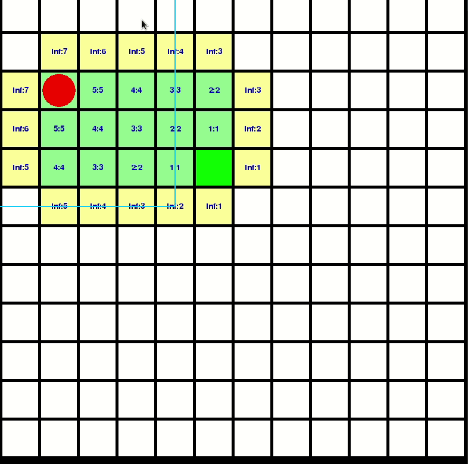

# D-Star-Lite
## An fork from [medyo](https://github.com/mdeyo/d-star-lite). This version is focused on demonstrating how computations propagate in D-Star-Lite.

This poject is based on the original [D* Lite paper](http://idm-lab.org/bib/abstracts/papers/aaai02b.pdf) by Sven Koenig and Maxim Likhachev.

The D* Lite algorithm was written to be a "novel fast replanning method for robot navigation in unknown terrain". It searches "from the goal vertex towards the current vertex of the robot, uses heuristics to focus the search" and efficiently uses the priortity queue to minimize reordering.

### Use of the project

~~~bash
$python main.py
~~~
